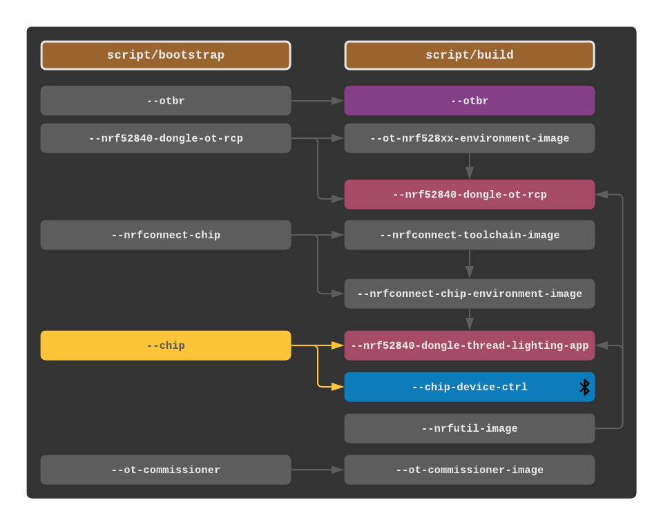

.. _Raspberry Pi: https://www.raspberrypi.org/products/
.. _Best Working SSD / Storage Adapters for Raspberry Pi 4 / 400: https://jamesachambers.com/best-ssd-storage-adapters-for-raspberry-pi-4-400/
.. _Raspberry Pi 4 Bootloader USB Mass Storage Boot Guide: https://jamesachambers.com/new-raspberry-pi-4-bootloader-usb-network-boot-guide/
.. _ARM64 Raspberry Pi OS Lite: https://downloads.raspberrypi.org/raspios_lite_arm64/images/raspios_lite_arm64-2021-05-28/
.. _nRF52840 Dongle: https://www.nordicsemi.com/Products/Development-hardware/nRF52840-Dongle/GetStarted
.. _docker: https://docs.docker.com/engine/install/ubuntu/
.. _Raspberry Pi Imager: https://www.raspberrypi.org/software/
.. _How to Boot Raspberry Pi 4 / 400 From a USB SSD or Flash Drive: https://www.tomshardware.com/how-to/boot-raspberry-pi-4-usb

Getting Started
===============

Project Requirements
--------------------

This guide covers multiple recommended configurations.  The **RPi + Linux Desktop** configuration features the fastest build and execution times.  If a Linux Desktop is not available, the **RPi Only** or **RPi + SSD** configurations may be used with the latter having slightly faster build times over using just an SD card in the RPi.

.. tabs::

   .. group-tab:: RPi + Linux Desktop

     - x64 Ubuntu Linux Desktop ("Linux Desktop" in this guide)
     - `Raspberry Pi`_ 4B ("RPi" in this guide)
     - 3x `nRF52840 Dongle`_
     - External 5V AC RPi adapter (CanaKit 3.5A USB-C Used)
     - 32Gb+ microSD card ("SD card" in this guide, 32Gb EVO+ Class 10 used)
     - microSD card reader
     - Ethernet cable

   .. group-tab:: RPi Only

     - Desktop PC
     - `Raspberry Pi`_ 4B ("RPi" in this guide, RPi 4B used)
     - 3x `nRF52840 Dongle`_
     - External 5V AC RPi adapter (CanaKit 3.5A USB-C Used)
     - 32Gb+ microSD card ("SD card" in this guide, 32Gb EVO+ Class 10 used)
     - microSD card reader
     - Ethernet cable

   .. group-tab:: RPi + SSD

     - Desktop PC
     - `Raspberry Pi`_ 4B ("RPi" in this guide)
     - 3x `nRF52840 Dongle`_
     - External 5V AC RPi adapter (CanaKit 3.5A USB-C Used)
     - microSD card ("SD card" in this guide, just to hold bootloader, 32Gb EVO+ Class 10 used)
     - microSD card reader
     - Ethernet cable
     - powered USB 3.0 hub (Sabrent 5V/2.5A 4-port USB 3.0 hub used)
     - external USB 3.0 SSD (Samsung T7 500GB SSD used)

     .. note::

        See `Best Working SSD / Storage Adapters for Raspberry Pi 4 / 400`_ and `Raspberry Pi 4 Bootloader USB Mass Storage Boot Guide`_ for recommended external storage options.

.. note::

   The Linux Desktop/Desktop PC and RPi must be connected to the same LAN.

.. warning::

   The RPi must use an external AC adapter of the proper voltage.  Do not power from a USB hub or a computer's USB port.

Preparing the RPi Boot Medium
-----------------------------

#. On the Linux Desktop/Desktop PC, download and extract the `ARM64 Raspberry Pi OS Lite`_ image.

   .. note::

      The 64-bit version is *required* for the **RPi Only** or **RPi + SSD** configurations to run the OpenThread build toolchain.

   .. tabs::

      .. group-tab:: Linux

         ::

            unzip YYYY-MM-DD-raspios-buster-arm64-lite.zip

      .. group-tab:: macOS

         Double click the :code:`.zip` archive to extract the :code:`.img` in the same folder.

      .. group-tab:: Windows

         Double click the :code:`.zip` archive.  Drag the :code:`.img` file to a desired location.

#. Download, install, and run `Raspberry Pi Imager`_.

   .. tabs::

      .. group-tab:: Linux

         ::

            # this will probably fail due to missing dependencies, that's okay
            sudo dpkg -i /path/to/imager_<X.Y.Z>_amd64.deb

            # this fixes it
            sudo apt-get install -f

            # refresh binaries known to the shell
            hash -r

            # launch the app
            rpi-imager

      .. group-tab:: macOS

            Install to **Applications** from the downloaded :code:`.dmg` file and run the app.

      .. group-tab:: Windows

            Run the downloaded :code:`.exe` installer and run the app.

#. Install the OS onto the RPi's boot medium.

   .. tabs::

      .. group-tab:: RPi + Linux Desktop

         #. Click **Choose OS** > **Use custom**  and select the :code:`YYYY-MM-DD-raspios-buster-arm64-lite.img`.

         #. Plug the microSD card reader and SD card into the Linux Desktop.

         #. Click **Choose Storage** and select the SD card.

         #. Click **Write**.

      .. group-tab:: RPi Only

         #. Click **Choose OS** > **Use custom**  and select the :code:`YYYY-MM-DD-raspios-buster-arm64-lite.img`.

         #. Plug the microSD card reader and SD card into the Desktop PC.

         #. Click **Choose Storage** and select the SD card.

         #. Click **Write**.

      .. group-tab:: RPi + SSD

         #. Click **Choose OS** > **Misc utility images** > **Bootloader** > **USB Boot**.

         #. Plug the microSD card reader and SD card into the Desktop PC.

         #. Click **Choose Storage** and select the SD card.

         #. Click **Write**.

         #. Safely eject the SD card and plug it into the RPi.

         #. Click **Choose OS** > **Use custom**  and select the :code:`YYYY-MM-DD-raspios-buster-arm64-lite.img`.

         #. Plug the external USB 3.0 SSD into the Desktop PC.

         #. Click **Choose Storage** and select the external USB 3.0 SSD.

         #. Click **Write**.

#. Enable SSH on boot.  A FAT32 :code:`boot` partition should have mounted once the OS has been installed.  If it did not, check the system's documentation for mounting the partition.  Reseat the boot medium if all else fails.  Add an empty file called :code:`ssh` into the root of the partition.

   .. tabs::

      .. group-tab:: Linux

         Clicking on the volume in any modern File Manager will typically mount the partition.

         ::

            touch /media/$USER/boot/ssh

      .. group-tab:: macOS

         The volume can be mounted using :code:`Disk Utility`.

         ::

            touch /Volumes/boot/ssh

      .. group-tab:: Windows

         From Windows Explorer, navigate to the mounted partition, right-click in the folder, and select **New** > **Text Document**.  Name the file :code:`ssh` without any file extension.

#. Optionally, change the RPi's hostname ("matter-demo" in this guide) to avoid naming conflicts with other RPis on the LAN.  An EXT4 :code:`rootfs` partition should have mounted once the OS has been installed.  If it did not, check the system's documentation for mounting the partition.  For systems that cannot mount writeable EXT4 partitions, this step can be performed later directly on the RPi.  The hostname will be used to connect to the RPi (e.g. :code:`matter-demo.local`).

   .. tabs::

      .. group-tab:: Linux

         ::

            # verify the existing hostname (default is "raspberrypi")
            cat /media/$USER/rootfs/etc/hostname

            # overwrite the hostname and verify
            echo matter-demo | sudo tee /media/$USER/rootfs/etc/hostname
            cat /media/$USER/rootfs/etc/hostname

#. Safely eject the RPi's boot medium and remove it from the Linux Desktop/Desktop PC.

#. For the **RPi + SSD** configuration, update the bootloader for USB boot.  The SD card should already be plugged into the RPi.  Power the RPi to update the bootloader from the SD card.  The green activity light will blink a steady pattern once the update has been completed.  If an HDMI monitor is attached to the RPi, the screen will go green once the update is complete. Allow 10 seconds or more for the update to complete.  Do not remove the SD card until the update is complete.  Power off the RPi and remove the SD card.

#. Plug the boot medium into the RPi, connect the RPi to the LAN via Ethernet, and power it on.

   .. warning::

      If the boot medium is an external USB 3.0 SSD, make sure to plug it in through the powered USB 3.0 hub to a USB 3.0 (blue) port on the RPi.  This ensures the nRF52840 dongles have enough power and the USB SSD has maximum throughput.  Briefly disconnect the hub from the RPi when first powering it on to ensure it doesn't use the hub for power.  Restore the hub's connection to the RPi a couple seconds after powering the RPi so it can boot off the external USB 3.0 SSD.  **Software initiated reboots do not have this requirement.**

#. Once booted, SSH into the RPi from the Linux Desktop/Desktop PC.  If the hostname was changed, the RPi can be reached via :code:`<hostname>.local`, otherwise, it should be reachable via :code:`raspberrypi.local`.  If multiple RPis are on the LAN, check the LAN's router for the correct IP address.

   ::

      # default password is "raspberry"
      ssh pi@matter-demo.local

.. _Preparing the RPi:

Preparing the RPi
-----------------

#. Optionally, if not already done, change the RPi's hostname ("matter-demo" in this guide) to avoid naming conflicts with other RPis on the LAN.

   ::

      # verify the existing hostname (default is "raspberrypi")
      cat /etc/hostname

      # overwrite the hostname and verify
      echo matter-demo | sudo tee /etc/hostname
      cat /etc/hostname

#. Update the system.

   ::

      apt-get update && sudo apt-get upgrade -y

#. Disable Bluetooth management.

   ::

      sudo systemctl mask bluetooth

#. Reboot the RPi and reconnect to it.

   ::

      sudo reboot
      ssh pi@matter-demo.local

#. Install docker.

   ::

      curl -sSL https://get.docker.com | sh
      sudo usermod -aG docker $USER

#. Log out and log back in so that group memberships are re-evaluated.

   ::

      exit
      ssh pi@matter-demo.local

#. Create a docker network attached to the host's broadcast domain.

   .. note::

      The :code:`169.254.0.0/16` IPv4 link-local space won't be used for network traffic, but an IPv4 address is required by the docker network driver and every container connected directly to the host's broadcast domain needs a unique IPv4 address as it is used in MAC address generation.

   ::

      docker network create -d macvlan \
       --subnet=169.254.0.0/16 \
       -o parent=eth0 matter-bridge

#. Install git.

   ::

      sudo apt-get install -y git

#. Clone or update this project's repository.

   .. tabs::

      .. group-tab:: Clone

         ::

            # clone the repository
            git clone https://github.com/caubut-charter/matter-rpi4-nRF52840-dongle.git
            cd matter-rpi4-nRF52840-dongle

      .. group-tab:: Update

         .. warning::

            Changes to the current branch will be reset.  If desired, stash or save in another branch or they will be lost.

         ::

            # fetch changes from the upstream repository
            git fetch
            # reset any changes
            git reset --hard
            # update local main to origin main
            git checkout -B main origin/main

Preparing the Linux Desktop
---------------------------

.. note::

   This section is for **RPi + Linux Desktop** configurations only.

#. Install `docker`_ if not present on the system.

   ::

      # check if installed
      docker --version

#. Add the current user to the :code:`docker` group.

   ::

      # check if in the docker group
      id -nG $USER | grep docker

      # add user to group if necessary
      sudo usermod -aG docker $USER

#. Log out and log back in so that group memberships are re-evaluated.

#. Capture the LAN interface.

   ::

      ping -c 1 matter-demo.local
      export LAN_IF=$(arp -a | grep $(avahi-resolve -4 --name matter-demo.local | awk '{print $2}') | awk 'NF>1{print $NF}')
      echo $LAN_IF

#. Create a docker network attached to the host's broadcast domain.

   .. note::

      The :code:`169.254.0.0/16` IPv4 link-local space won't be used for network traffic, but an IPv4 address is required by the docker network driver and every container connected directly to the host's broadcast domain needs a unique IPv4 address as it is used in MAC address generation.

   ::

      docker network create -d macvlan \
       --subnet=169.254.0.0/16 \
       -o parent=$LAN_IF matter-bridge

#. Install git.

   ::

      sudo apt-get install -y git

#. Clone or update this project's repository.

   .. tabs::

      .. group-tab:: Clone

         ::

            # clone the repository
            git clone https://github.com/caubut-charter/matter-rpi4-nRF52840-dongle.git
            cd matter-rpi4-nRF52840-dongle

      .. group-tab:: Update

         .. warning::

            Changes to the current branch will be reset.  If desired, stash or save in another branch or they will be lost.

         ::

            # fetch changes from the upstream repository
            git fetch
            # reset any changes
            git reset --hard
            # update local main to origin main
            git checkout -B main origin/main

Building
--------

Dependency management and artifact building is performed using two scripts in this repository, the :code:`script/bootstrap` script to manage dependencies and the :code:`script/build` script to build the artifacts.  Both support the :code:`-h` flag to list all available options.  Each dependency of the :code:`script/bootstrap` script accepts an optional checkout value for the repository it downloads (i.e. hash, commit, branch, tag).  As an example, it may be desirable to use one of the test event branches of the Connected Home IP (Matter) repository which may be more stable.

::

   script/bootstrap --chip test_event_6

For compatibility with this guide, it is recommended to use the :code:`ORG=caubutcharter` environment variable to set the organization of the built docker images.  Nightly builds of these images are pushed to Docker Hub using this organization as an alternative to building them.

::

   ORG=caubutcharter script/build

Existing clones that already have build artifacts can be cleaned using the :code:`--clean`, or :code:`-c`, flag when building.  If this flag is set, it occurs before any other build step.

::

   script/build --clean [ARTIFACT ..]

Permission errors may occur due to docker containers creating files and directories on mounted volumes as the root user on the host.  The scripts will always attempt to fix them incrementally as it runs, but if permissions issue are triggered, the :code:`--fix-permissions`, or :code:`-f`, flag will (slowly) repair the entire project and is available on both scripts.  If this flag is set, it occurs before any other step.

::

   script/bootstrap --fix-permissions
   script/build --fix-permissions

To completely restore the project to its initial state and update all dependencies, the following example sequence can be used.

::

   script/bootstrap -f && script/build -c

With the basics covered, there are two ways to work through this guide.

#. build the artifacts
#. download the artifacts built nightly

For a single host setup (e.g. **RPi Only** and **RPi + SSD** configurations), everything can be pre-built with the following command.

::

   # fresh repository
   script/bootstrap && ORG=caubutcharter script/build --all

   # dirty repository
   script/bootstrap -f && ORG=caubutcharter script/build -c --all

For multiple hosts (e.g. **RPi + Linux Desktop** configuration), the dependency graph of the inputs and outputs of these two commands must be considered if looking to download only the required dependencies and build only the required artifacts on each host.  Each colored box represents a final build artifact.

The following is recommended for the **RPi + Linux Desktop** configuration to reduce build times while the final demo runs entirely on the RPi.  This setup favors building and flashing all firmware (magenta) from the Linux Desktop as well as building and running most utilities (green).  Services (purple) are recommended to run on the RPi.  The :code:`chip-device-ctrl` (blue) is favored to run on the RPi to use the Bluetooth radio through docker which is disruptive to the host.

#. Build the Linux Desktop artifacts.

   ::

      script/bootstrap \
       --chip \
       --nrfconnect-chip \
       --ot-commissioner \
       --ot-nrf528xx
      script/build \
       --avahi-utils-image \
       --nrf52840-dongle-ot-rcp \
       --nrf52840-dongle-thread-lighting-app \
       --nrfconnect-chip-environment-image \
       --nrfconnect-toolchain-image \
       --nrfutil-image \
       --ot-commissioner-image \
       --ot-nrf528xx-environment-image

#. Build the RPi artifacts.

   ::

      script/bootstrap \
       --chip \
       --ot-br-posix
      script/build \
       --chip-device-ctrl \
       --chip-environment-image \
       --otbr-image

After building new docker images, the old images and build layers can be removed to recover disk space.

   .. warning::

      This will remove any build layers and untagged images not attached to a container on the entire system, even for other users or projects.

   ::

      docker image prune

::

   docker pull caubutcharter/avahi-utils:latest
   docker pull caubutcharter/chip-environment:latest
   docker pull caubutcharter/nrfconnect-chip-environment:latest
   docker pull caubutcharter/nrfutil:latest
   docker pull caubutcharter/ot-commissioner:latest
   docker pull caubutcharter/ot-nrf528xx-environment:latest

+--------------------------------------------------------------------------+-------------------------------------------------------------+
| Build                                                                    | Download                                                    |
+==========================================================================+=============================================================+
| **OpenThread Border Router**                                             |                                                             |
+--------------------------------------------------------------------------+-------------------------------------------------------------+
| ::                                                                       | ::                                                          |
|                                                                          |                                                             |
|    script/bootstrap --ot-br-posix                                        |    docker pull caubutcharter/otbr:latest                    |
|    script/build --otbr-image                                             |                                                             |
+--------------------------------------------------------------------------+-------------------------------------------------------------+
| **OpenThread Commissioner**                                              |                                                             |
+--------------------------------------------------------------------------+-------------------------------------------------------------+
| ::                                                                       | ::                                                          |
|                                                                          |                                                             |
|    script/bootstrap --ot-commissioner                                    |    docker pull caubutcharter/ot-commissioner:latest         |
|    script/build --ot-commissioner-image                                  |                                                             |
+--------------------------------------------------------------------------+-------------------------------------------------------------+
| **Avahi Utilities**                                                      |                                                             |
+--------------------------------------------------------------------------+-------------------------------------------------------------+
| ::                                                                       | ::                                                          |
|                                                                          |                                                             |
|    script/build --avahi-utils-image                                      |    docker pull caubutcharter/avahi-utils:latest             |
+--------------------------------------------------------------------------+-------------------------------------------------------------+
| **nrf52580 Dongle OpenThread Border Router Radio Co-Processor Firmware** |                                                             |
+--------------------------------------------------------------------------+-------------------------------------------------------------+
| ::                                                                       | ::                                                          |
|                                                                          |                                                             |
|    script/bootstrap --ot-nrf528xx                                        |    docker pull caubutcharter/ot-nrf528xx-environment:latest |
|    script/build --ot-nrf528xx-environment-image                          |                                                             |
+--------------------------------------------------------------------------+-------------------------------------------------------------+
| ::                                                                       | ::                                                          |
|                                                                          |                                                             |
|    docker pull caubutcharter/nrfutil:latest                              |    docker pull caubutcharter/nrfutil:latest                 |
|    script/build --nrfutil-image                                          |                                                             |
|                                                                          | (required to flash the image)                               |
+--------------------------------------------------------------------------+-------------------------------------------------------------+
| ::                                                                       | ::                                                          |
|                                                                          |                                                             |
|    script/build --nrf52840-dongle-ot-rcp                                 |    wget/curl                                                |
+--------------------------------------------------------------------------+-------------------------------------------------------------+
| **nrf52840 Dongle Thread Lighting App Firmware**                         |                                                             |
+--------------------------------------------------------------------------+-------------------------------------------------------------+
| ::                                                                       | ::                                                          |
|                                                                          |                                                             |
|    script/bootstrap --nrfconnect-chip                                    |    docker pull caubutcharter/nrfconnect-toolchain           |
|    script/build --nrfconnect-toolchain-image                             |                                                             |
+--------------------------------------------------------------------------+-------------------------------------------------------------+
| ::                                                                       | ::                                                          |
|                                                                          |                                                             |
|    script/bootstrap --nrfconnect-chip                                    |    docker pull caubutcharter/nrfconnect-chip-environment    |
|    script/build --nrfconnect-chip-environment-image                      |                                                             |
+--------------------------------------------------------------------------+-------------------------------------------------------------+
| ::                                                                       | ::                                                          |
|                                                                          |                                                             |
|    script/build --nrfutil-image                                          |    docker pull caubutcharter/nrfutil:latest                 |
|                                                                          |                                                             |
|                                                                          | (required to flash the image)                               |
+--------------------------------------------------------------------------+-------------------------------------------------------------+
| ::                                                                       | ::                                                          |
|                                                                          |                                                             |
|    script/bootstrap --chip                                               |    wget/curl                                                |
|    script/build --nrf52840-dongle-thread-lighting-app                    |                                                             |
+--------------------------------------------------------------------------+-------------------------------------------------------------+
| **Python CHIP Controller**                                               |                                                             |
+--------------------------------------------------------------------------+-------------------------------------------------------------+
| ::                                                                       | ::                                                          |
|                                                                          |                                                             |
|    script/build --chip-environment-image                                 |    docker pull caubutcharter/chip-environment:latest        |
+--------------------------------------------------------------------------+-------------------------------------------------------------+
| ::                                                                       | ::                                                          |
|                                                                          |                                                             |
|    script/bootstrap --chip                                               |    script/boostrap --chip                                   |
|    script/build --chip-device-ctrl                                       |    wget/curl                                                |
+--------------------------------------------------------------------------+-------------------------------------------------------------+

References
----------

- `How to Boot Raspberry Pi 4 / 400 From a USB SSD or Flash Drive`_
