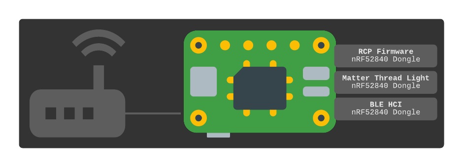
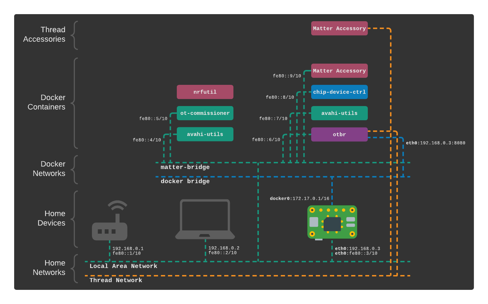

.. _Building with Matter: https://buildwithmatter.com/
.. _nRF52840 Dongles: https://www.nordicsemi.com/Products/Development-hardware/nRF52840-Dongle/GetStarted
.. _Raspberry Pi 4B: https://www.raspberrypi.org/products/
.. _container images: https://hub.docker.com/u/caubutcharter
.. _build artifacts: https://github.com/caubut-charter/matter-rpi4-nRF52840-dongle/releases/tag/nightly

Introduction
============

This project is a bootstrap guide for setting up a runnable example of `Building with Matter`_  on a `Raspberry Pi 4B`_ ("RPi" in this guide) using low-cost `nRF52840 Dongles`_.  The reader is assumed to have some outside understanding of Matter.  Instructions include how to build everything from scratch.  Containers are used when possible.  Build steps are executed via scripts in this repository which perform some minimal patching so everything works through the Raspberry Pi and to reduce container image sizes by sharing reusable dependencies as mounted volumes.  CI/CD pipelines are setup on this project to generate nightly builds of the `container images`_ and various `build artifacts`_ as an alternative option to building from scratch.

Main Components
---------------

+----------------------------------+---------------------------------------------------------------------------------------+
| Component                        | Description                                                                           |
+==================================+=======================================================================================+
| Thread Border Router             | Bridges a home Ethernet/WiFi network with a Thread network using OpenThread Border    |
|                                  |                                                                                       |
|                                  | Router (OTBR). The process requires a radio that work with Thread.  A Thread Radio    |
|                                  |                                                                                       |
|                                  | Co-Processor (RCP) built from an nRF52840 dongle serves this purpose.                 |
+----------------------------------+---------------------------------------------------------------------------------------+
| Matter Commissioner/Controller   | An application that can push WiFi/Thread credentials and Fabric information to a      |
|                                  |                                                                                       |
|                                  | Matter accessory via the RPi's built-in Bluetooth radio (commissioner).  Once         |
|                                  |                                                                                       |
|                                  | commissioned, it can send commands, such as on/off (controller).  This guide uses the |
|                                  |                                                                                       |
|                                  | python controller :code:`chip-device-ctrl`.                                           |
+----------------------------------+---------------------------------------------------------------------------------------+
| Matter Thread Accessory (WIP)    | A Matter accessory that connects to the local network via Thread.  An nRF52840 dongle |
|                                  |                                                                                       |
|                                  | with the lighting example is used.                                                    |
+----------------------------------+---------------------------------------------------------------------------------------+
| Matter Ethernet Accessory (TODO) | A Matter accessory that connects via Ethernet/WiFi.  An nRF52840 dongle is used for   |
|                                  |                                                                                       |
|                                  | this accessory's BLE radio so it can be commissioned by the RPi.                      |
+----------------------------------+---------------------------------------------------------------------------------------+

Physically, these components may resemble the following diagram when all running off a single RPi.

Other Components
----------------

+----------------------------------+-----------------------------------------------------------------------------+
| Component                        | Description                                                                 |
+==================================+=============================================================================+
| OpenThread Commissioner          | A Thread commissioner for end devices that do not use Matter.               |
|                                  |                                                                             |
|                                  | :code:`ot-commissioner` is used.                                            |
+----------------------------------+-----------------------------------------------------------------------------+
| DNS-SD Client                    | A DNS service discovery client.  :code:`avahi-utils` is used.               |
+----------------------------------+-----------------------------------------------------------------------------+
| nRF52840 Dongle Flashing Utility | A utility to upload firmware to nRF52840 dongles.  :code:`nrfutil` is used. |
+----------------------------------+-----------------------------------------------------------------------------+

Networking
----------

In order for service discovery to work, containers need to be attached to the same Local Area Network.  This project does this by attaching containers to the host's network using a macvlan.  Below is an example logical topology that allows containers to run on different hosts by using this method.  Should a test environment derived from this project outgrow a single host, it should still function the same when split over several hosts.

